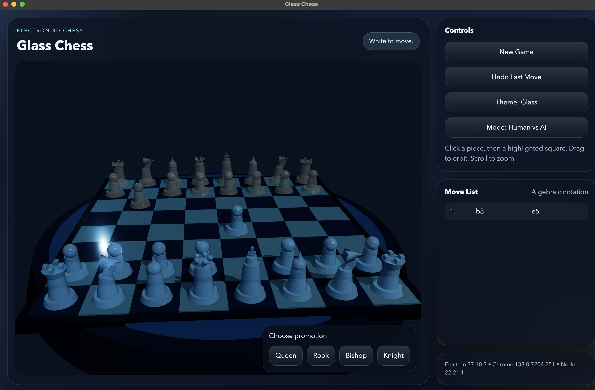
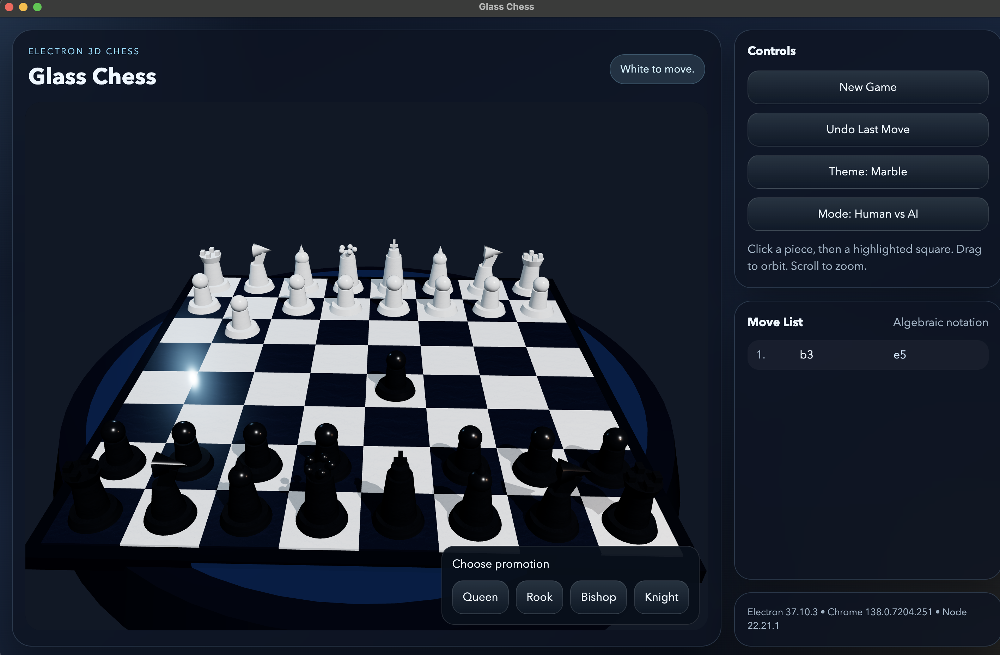
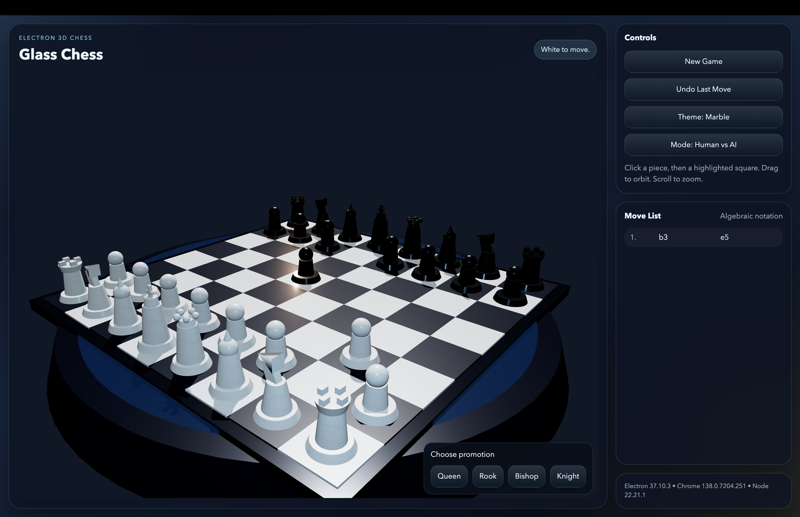

# Glass Chess

An Electron desktop app for playing chess on a 3D board with two visual themes: `Glass` and `Marble`.

## Features

- Electron + TypeScript desktop app
- 3D chessboard rendered with Three.js
- Full legal chess rules:
  - check, checkmate, stalemate
  - castling
  - en passant
  - promotion
- Modes:
  - Human vs AI
  - Human vs Human
- Move list in algebraic notation
- Undo last move
- Theme toggle between glass and marble materials
- Orbit camera controls and zoom

## Project Structure

```text
src/
  main/
    main.ts       Electron main process
    preload.ts    Safe preload bridge
  renderer/
    app.ts        UI state and interactions
    scene.ts      Three.js board, pieces, camera, themes
    index.ts      Renderer entry point
    index.html    Renderer HTML shell
    styles.css    App styling
  shared/
    chess.ts      Chess engine, move generation, AI, SAN notation
```

## Install and Run

From the project root:

```bash
npm install
npm start
```

Useful scripts:

```bash
npm run build
npm run typecheck
```

## Screenshots

Add image files under `docs/screenshots/` and reference them here.

### Glass Theme



### Marble Theme



### Legal Move Highlights



## Camera Preview


## How to Play

- Click a piece to select it.
- Legal destination squares are highlighted.
- Click a highlighted square to move.
- In Human vs AI mode, the human plays White and the AI plays Black.
- Drag to rotate the camera.
- Scroll to zoom.

## AI Behavior

The AI uses legal move generation plus a shallow minimax search with alpha-beta pruning. It is intentionally simple and beatable, but it does evaluate positions rather than choosing completely random moves.

## Notes

- The build uses `esbuild` for the Electron main process, preload script, and renderer bundle.
- Static assets for the renderer are copied into `dist/` before Electron launches.
- Suggested README asset layout:

```text
docs/
  screenshots/
    glass-theme.png
    marble-theme.png
    move-highlights.png
  media/
    camera-orbit.gif
```
